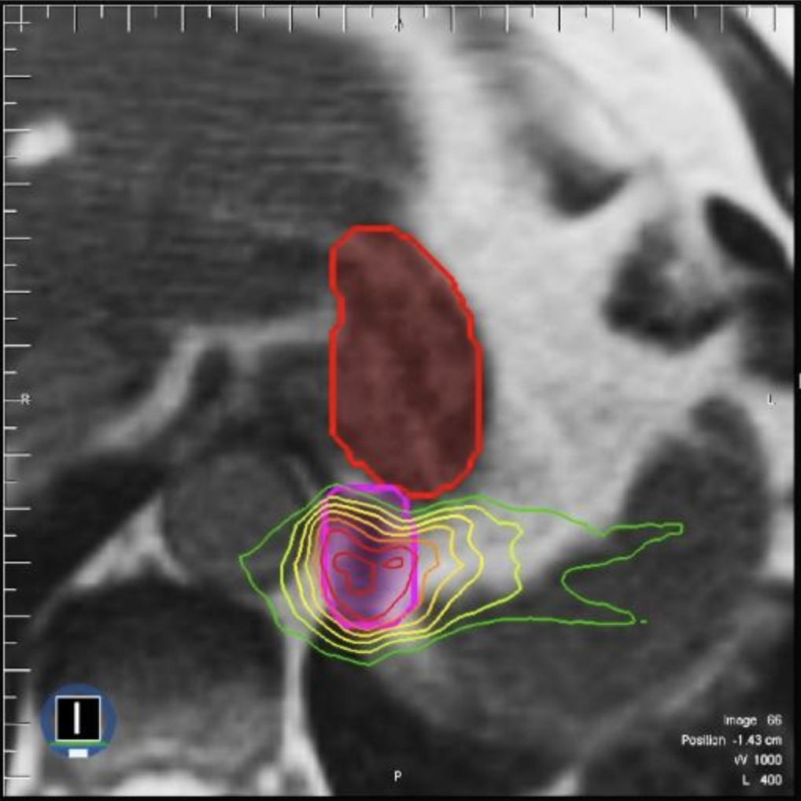
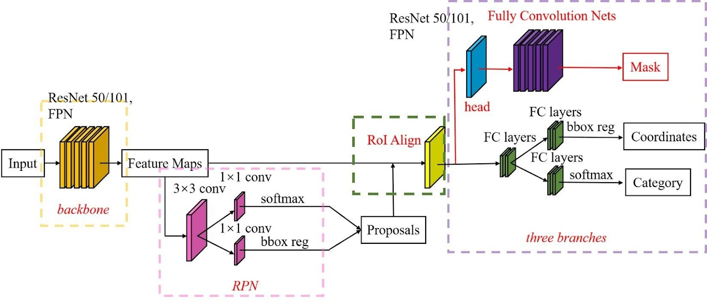
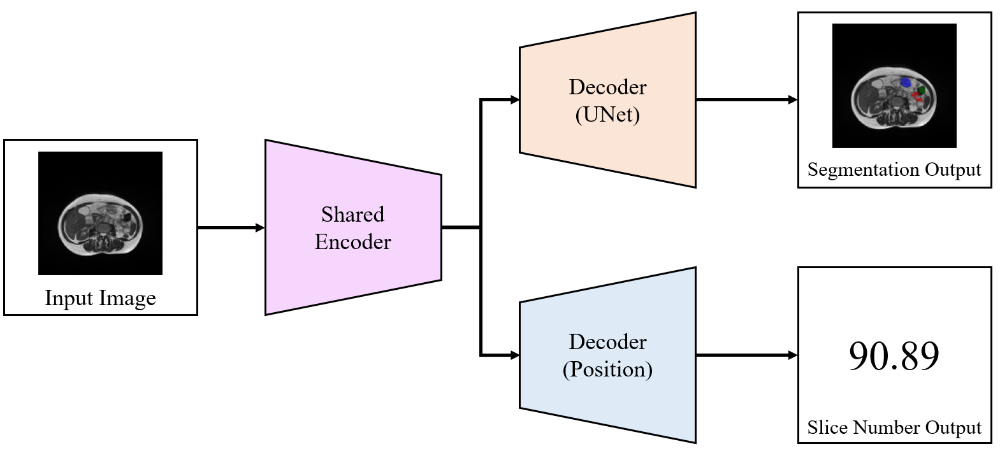
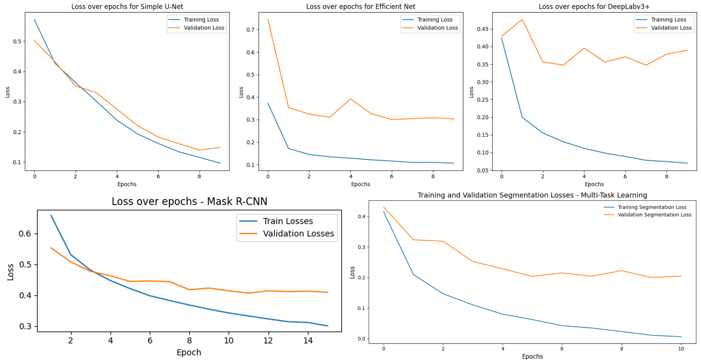
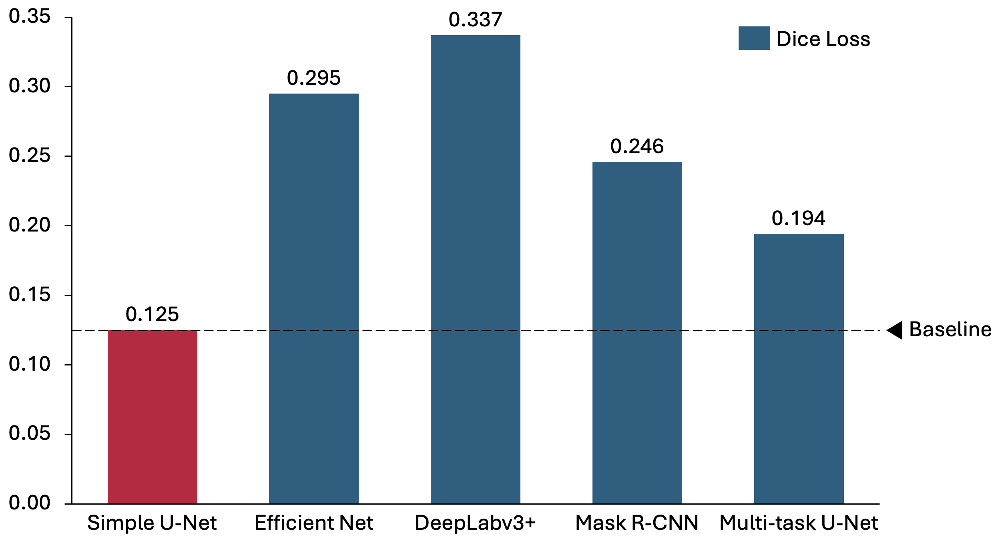
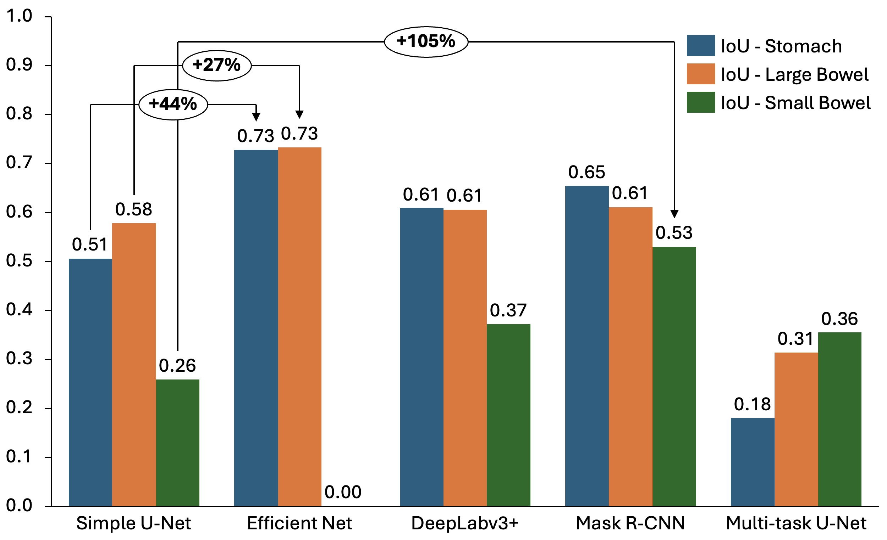
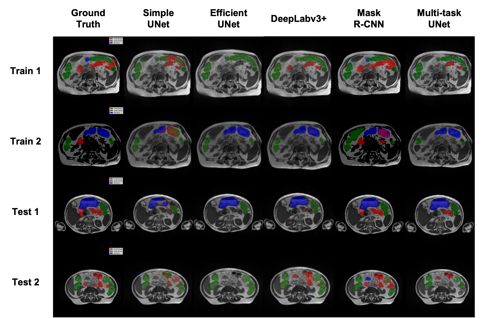

# Computer-Aided Segmentation of Gastrointestinal Structures

https://github.com/zikaiyan/Computer-Aided-Diagnosis-GI-Tract-Image-Segmentation/assets/102602472/8e542949-fb48-493a-8089-4642954a89e8

Final Project - 6.8300 - Advances in Computer Vision Course @MIT EECS

Project Members: [Zeki Yan](https://www.linkedin.com/in/zikaiyan/), [Srikaran Boya](https://www.linkedin.com/in/srikaran-reddy/), [Joe Kajon](https://www.linkedin.com/in/joseph-kajon/)

# Abstract

This paper introduces an innovative approach to computer-aided diagnosis for radiation therapy planning in gastrointestinal (GI) cancer patients. By applying deep learning methodologies to segment the stomach and intestines from MRI scans, we aim to expedite treatment procedures and optimize therapy outcomes. By leveraging anonymized MRIs from the UW-Madison Carbone Cancer Center, we employ advanced models such as UNet, DeepLabv3+, and R-CNNs, exploring multi-task learning through supervised approaches. We found that Efficient Net excels at segmenting the stomach and large bowels, while Mask R-CNN delivers the most balanced high performance across all three organs. This innovative approach has the potential to revolutionize radiation therapy planning, expediting treatment procedures and enabling radiation oncologists to concentrate more on treatment optimization, ultimately enhancing the overall effectiveness of therapies.

**Keywords**: MRI segmentation, Deep learning, U-Net, Efficient Net, DeepLabv3+, Mask R-CNNs, Multi-task learning

# Introduction

Gastrointestinal (GI) tract cancer significantly impacts global health, with millions diagnosed annually. Radiation therapy, a primary treatment for about half of these patients, typically involves 10-15 minute sessions daily for 1-6 weeks. Effective therapy requires precise planning to target tumors while avoiding critical organs like the stomach and intestines, necessitating labor-intensive manual segmentation of MRI scans. This manual process can extend treatment times to an hour, burdening patients and increasing the risk of human error. This paper introduces an innovative approach to streamline radiation therapy planning by integrating computer-aided diagnosis techniques.

# Dataset and Features

## Raw Dataset Details

The data can be accessed at the Kaggle competition [UW-Madison GI Tract Image Segmentation](https://www.kaggle.com/competitions/uw-madison-gi-tract-image-segmentation/data). The dataset contains 85 cases (patients); each has MRI scans on different days (usually 3-5 days) and different slices each day. The segmentation and class information is shown in the "train.csv" file.

## Data Preprocessing

We executed a series of data preprocessing measures to prepare for model training and evaluation. We developed a decoder and an encoder to facilitate the conversion between run-length encoding (RLE) representation of segmentation masks and binary mask formats, enabling straightforward manipulation and storage of these masks. Extensive metadata was extracted from MRI scan images, including case identifiers, day of scan, slice number, file path, file name, composite ID, image dimensions (height and width), and resolution. The dataset was partitioned into training, validation, and testing subsets, consisting of 65%, 15%, and 20%, stratified based on the number of organs shown in the image. Furthermore, all data was standardized into the Common Objects in Context (COCO) format, a common framework used to benchmark image segmentation tasks. Additionally, we compiled functions to facilitate data generation, image loading, and annotation processing, thereby optimizing the data pipeline and enhancing the efficacy and reproducibility of our segmentation models.

# Methods

## Encoder-Decoder Models

Encoder-Decoder Models represent a foundational approach in image semantic segmentation. We will employ a small, pre-trained U-Net model for our baseline due to its classical relevance and proven efficiency in similar tasks. Additionally, a larger U-Net model will enhance the prediction accuracy and handle more complex segmentation tasks effectively.

## Simple U-Net Model (Baseline)

The Simple U-Net architecture, a streamlined version of the original U-Net, maintains the core symmetrical encoder-decoder structure, facilitating effective feature extraction and contextual understanding crucial for detailed analysis of medical images. The following figure illustrates the foundational U-Net architecture upon which our model is based.

In refining the original design, the Simple U-Net employs dual-layer convolutional units within the encoder and decoder paths, each enhanced with instance normalization and Leaky ReLU activation to improve non-linear feature learning and stabilization across network layers. The architecture also incorporates efficient downsampling via max pooling and sophisticated upsampling through transpose convolutions, integrated with skip connections to preserve and restore spatial and contextual information lost during feature compression.  This design ensures the production of high-quality segmentation maps with precise boundary delineations and optimizes computational efficiency, making it suitable for handling large datasets given the constrained resources. The model leverages the aiming normalization technique for weight initialization, significantly improving training dynamics and convergence speed.

## Large U-Net Model (Efficient Net)

In our approach, we incorporate the EfficientNet-B6 as the encoder within a U-Net architecture, leveraging its advanced capabilities for deep feature extraction. Utilizing the U-Net configuration, the model employs efficientnet-b6, pre-trained on the ImageNet dataset, ensuring a rich initial feature space conducive to complex segmentation tasks. The network output is activated by a sigmoid function, facilitating the generation of class probabilities suitable for multi-class segmentation. 

## DeepLabv3+ Model

We also utilize the DeepLabV3+ model, integrated with a ResNeXt101\_32x8d encoder, to harness its sophisticated segmentation capabilities. The model benefits from the ResNeXt architecture, which is known for its aggregated residual transformations that enhance model capacity and efficiency. This configuration leverages weights pre-trained on the ImageNet dataset, offering a solid foundational understanding of diverse visual features necessary for accurate and detailed segmentation. The output layer utilizes a sigmoid activation function to produce a probability map for each class, enabling precise pixel-wise classification.

## Mask R-CNN Model

Mask R-CNN enhances the capabilities of Faster R-CNN by integrating a branch dedicated to predicting segmentation masks for each Region of Interest (RoI). This branch operates concurrently with the branches for classification and bounding box regression. Mask R-CNN's dual functionality ensures high accuracy and maintains processing speed, making it an ideal choice for our project.

## Multi-task Learning: Position Learning

We integrated multi-task learning to enhance the baseline model by leveraging positional learning alongside U-Net architecture. This is designed to extract richer contextual information from the images, specifically the slice numbers of the MRI scans.

Multi-task learning entails performing two tasks simultaneously. In this case, (1) semantic segmentation of medical images to identify the three organs of interest (stomach, large bowel, and small bowel) through U-Net, and (2) regression of the position of each cross-sectional scan within the image. This joint task allows the model to capture fine-grained spatial details and global positional information from the input images. The following figure shows that the U-Net takes the image and shares the encoder weights with the two task-specific decoders.

# Evaluation Metric

## Dice Loss

The Dice loss function is universally applied across all our methods to evaluate the similarity between two binary masks. Consider two binary masks, \(M_1\) and \(M_2\), which correspond to the set of pixels each mask covers. The Dice coefficient for these masks is calculated as follows:
$$
C = \frac{2 \times |M_1 \cap M_2|}{|M_1| + |M_2|}
$$

where $| \cdot |$, denotes the number of pixels in the set. The coefficient $C$ ranges between 0 and 1, where a Dice coefficient of 1 indicates perfect overlap between the masks and 0 indicates no overlap.

For $M_1$ as the predicted mask and $M_2$ as the true mask, the Dice loss is defined as:

$$
L_{\text{Dice}} = 1 - C
$$
Our objective is to minimize this Dice loss, $L_{\text{Dice}}$, to improve the accuracy of the predicted mask in matching the true mask.

## Intersection over Union (IoU)

Intersection over Union (IoU) is a metric used to evaluate the accuracy of an object detector on a particular dataset.

$$
IoU = \frac{|M_1 \cap M_2|}{|M_1 \cup M_2|} = \frac{|M_1 \cap M_2|}{|M_1| + |M_2| - |M_1 \cap M_2|}
$$
IoU provides a value between 0 and 1, where 0 means no overlap, and 1 represents perfect overlap. A higher IoU score indicates a more accurate model. In practice, a threshold (like 0.5) is often used to decide whether predictions are correct.

For evaluating models, IoU is favored over Dice Loss. Since Mask R-CNN is not fit for Dice Loss, it will naturally have a higher loss, leading to unfair comparisons between models.

# Results

## Evaluation Metrics Analysis

| Model            | DiceLoss  | IoU-S     | IoU-LB    | IoU-SB    |
| ---------------- | --------- | --------- | --------- | --------- |
| Simple U-Net     | **0.125** | 0.506     | 0.578     | 0.259     |
| Efficient Net    | 0.295     | **0.728** | **0.733** | 0.000     |
| DeepLabv3+       | 0.337     | 0.609     | 0.606     | 0.372     |
| Mask R-CNN       | 0.246     | 0.654     | 0.611     | **0.530** |
| Multi-task U-Net | 0.194     | 0.180     | 0.314     | 0.355     |

The above table presents the evaluation metrics of five models based on their performance of the test dataset. The baseline Simple U-Net model achieves the lowest Dice Loss and records satisfactory IoU scores across all three organs. The EfficientNet model demonstrates superior performance in segmenting the stomach and large bowels. In contrast, Mask R-CNN significantly outperforms the other models regarding the IoU score for the small bowel. Implementing multi-task learning improves the IoU score only for the small bowel, which may be attributed to the low prediction accuracy of the auxiliary task. The efficient net may inadequately preserve fine-grained spatial information, exacerbating the challenge of accurately delineating the fragmented segments of the small bowel. As a result, this limitation might contribute to blurry or imprecise predictions for its boundaries, ultimately resulting in a lower IoU score. In summary, considering all performance metrics, Mask R-CNN emerges as the most balanced model, exhibiting high performance across each evaluated metric. 

## Error Analysis

Training and loss analysis of segmentation models, including Simple U-Net, Efficient Net, and DeepLabv3+, reveals insights into their performance dynamics. For Simple U-Net, the training loss steadily decreases over epochs, indicating effective optimization and learning of features. However, the validation loss tends to fluctuate, suggesting potential overfitting or instability in performance on unseen data. In contrast, Efficient Net demonstrates a consistent decrease in both training and validation losses, indicative of robust optimization and generalization. DeepLabv3+, while exhibiting a decreasing trend in both losses, shows higher fluctuations in validation loss, potentially indicating sensitivity to variations in the validation dataset. 

Mask R-CNN model uses its own loss function, which is a combination of *Classification Loss*, *Bounding Box Regression Loss*, and *Mask Loss*, rather than *Dice Loss*. Therefore, its training loss value cannot be compared with other models. Mask R-CNN's loss graph shows that the training loss is at first higher than validation loss but is reducing at a fast speed and is less than validation loss after the third epoch and continues to go down. The validation loss, however, is relatively stable after epoch 9. Thus, we choose epoch 9's model as the final model.

Implementing multi-task learning has a negative effect on the baseline, significantly decreasing IoU metrics. Predicting the slice number proved to be difficult, and the relatively high MSE seems to have hurt the model more than aid it. Also, this additional task for positional learning may encourage the model to focus on global features of the image and therefore not put as much emphasis on the fine-grained details that are important for accurate segmentation. To compare loss, the visualization below just highlights dice loss. Note as with other loss metrics, the validation loss plateaus after epoch 5, so epoch 5 is chosen as the final model.

# Appendices

# References

1. Wenjia Bai and Dinggang Shen. Self-supervised learning for cardiac mr image segmentation by anatomical position prediction. In Medical Image Computing and Computer Assisted Intervention–MICCAI 2019, Cham, 2019. Springer.
2. Rich Caruana. Multitask learning. Machine Learning, 28:41–75, 1997.
3. Liang-Chieh Chen, George Papandreou, Florian Schroff, and Hartwig Adam. Rethinking atrous convolution for semantic image segmentation, 2017
4. Liang-Chieh Chen, Yukun Zhu, George Papandreou, Florian Schroff, and Hartwig Adam. Encoder-decoder with atrous separable convolution for semantic image segmentation, 2018.
5. Jia Deng, Wei Dong, Richard Socher, Li-Jia Li, Kai Li, and Li Fei-Fei. Imagenet: A large-scale hierarchical image database. In 2009 IEEE conference on computer vision and pattern recognition, pages 248–255. Ieee, 2009.
6. Ross Girshick, Jeff Donahue, Trevor Darrell, and Jitendra Malik. Rich feature hierarchies for accurate object detection and semantic segmentation, 2014.
7. Kaiming He, Georgia Gkioxari, Piotr Doll ́ar, and Ross Girshick. Mask r-cnn, 2018.
8. Kaiming He, Xiangyu Zhang, Shaoqing Ren, and Jian Sun. Delving deep into rectifiers: Surpassing human-level performance on imagenet classification. Proceedings of the IEEE international conference on computer vision, pages 1026–1034, 2015.
9. Tsung-Yi Lin, Michael Maire, Serge Belongie, James Hays, Pietro Perona, Deva Ramanan, Piotr Doll ́ar, and C. Lawrence Zitnick. Microsoft coco: Common objects in context. In David Fleet, Tomas Pajdla, Bernt Schiele, and Tinne Tuyte- laars, editors, Computer Vision – ECCV 2014, pages 740–755, Cham, 2014. Springer International Publishing.
10. Jelena Novosel, Prashanth Viswanath, and Bruno Arsenali. Boosting semantic segmentation with multi-task self-supervised learning for autonomous driving applications. In Proc. of NeurIPS-Workshops, volume 3, 2019.
11. Olaf Ronneberger, Philipp Fischer, and Thomas Brox. U-net: Convolutional networks for biomedical image segmentation, 2015.
12. Mingxing Tan and Quoc V. Le. Efficientnet: Rethinking model scaling for convolutional neural networks. In Proceedings of the 36th International Conference on Machine Learning, volume 97, pages 6105–6114, 2019.
13. Saining Xie, Ross Girshick, Piotr Doll ́ar, Zhuowen Tu, and Kaiming He. Aggregated residual transformations for deep neural networks. In Proceedings of the IEEE conference on computer vision and pattern recognition, pages 1492–1500, 2017.
